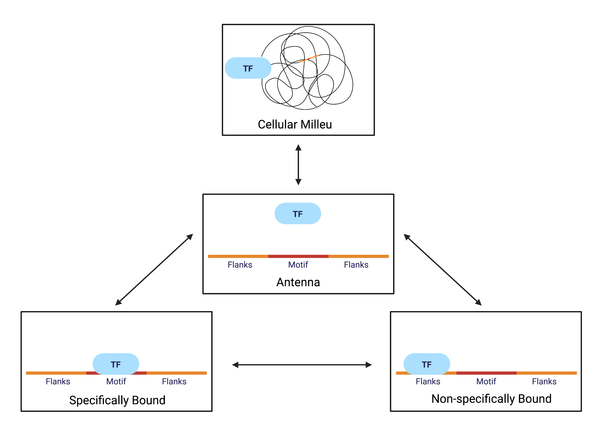

## Running a simulation or a sensitivity analysis
1) Ssh into sherlock. Clone this repository using `git clone`. Run `ml python/3.6.1`.
2) Run a parallelized simulation using the following command: `python parallel_simulation.py n_runs simulation_type`. `n_runs` indicates how many jobs you want to submit or how many times you want to run the simulation. `simulation_type` indicates what to run, whether the baseline simulation, indicated with `simulation` passed in (or a variation with different motif affinity such as `simulation_mutated` or `simulation_strong`), or a sensitivity analysis, which can be one of the following: `n_flanks`, `core_affinity`, `koff_slope`, `koff_intercept`, `n_TF`, `switching_ratio`, `diffusion`, `DNA_concentration`, `local_volume`. For each analysis you do, make sure to create a folder titled with the `simulation_type` you are calling as well as a folder titled `simulation_output` within it. In addition, create a folder titled `txt_output` which is where the outputs from all the jobs will be saved so that you can track jobs or see any errors. There are also a few simulation types that are intended to run locally and do not require parallelization. These are `mfpt_simulation`, which runs a simulation of just MFPT, `one_simulation`, which runs one simulation with repeat and random values and plots example single molecule traces, and `steady_state`, which attempts to calculate the steady state of your system.
3) Check on the status, whether the jobs finished and if there were any errors by calling `cat txt_output/*`. You can also use `squeue -u suid` to check on whether or not jobs are running.
4) Process a simulation using the following command: `python3 process.py n_runs simulation_type`. Alternatively, create a directory called download and then you can process all simulations and copy the output plot to that directory using the command: `python3 process.sh`.
